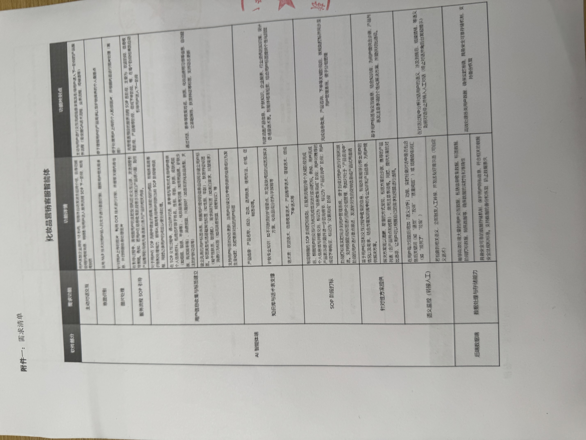

# studyz

Generated with https://github.com/zmrlft/GreenWall.

# project wall

1、DAG 工作流 Workflow 编排和调用、主要为工作流节点的调用。提供 LLM 相关节点和 Function 相关节点。

2、数字人/智能客服的编排和调用，主要为 RAG 应用，需要再增加一些合法合规的校验。参考药妆进行优化。

3、ztimer 定时任务处理，新增前端接口页面用于做展示。

4、错误码管理系统，也进行展示，优化更好用的功能，不然太难用了。【必须要进行优化/自动生成错误/自动查询】

5、标书智能体内容的重构。
